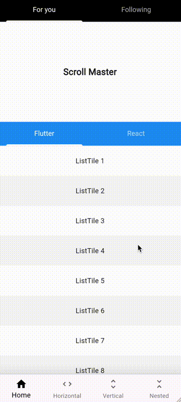

# scroll_master

A Flutter example showcasing efficient resolution of scrolling conflicts.

It demonstrates features like pull-to-refresh for NestedScrollView, synchronized scrolling for ScrollView and TabView, and other enhancements.

## 🔥 Preview

Try it online: [https://flutter-scroll-master.vercel.app/](https://flutter-scroll-master.vercel.app/)
